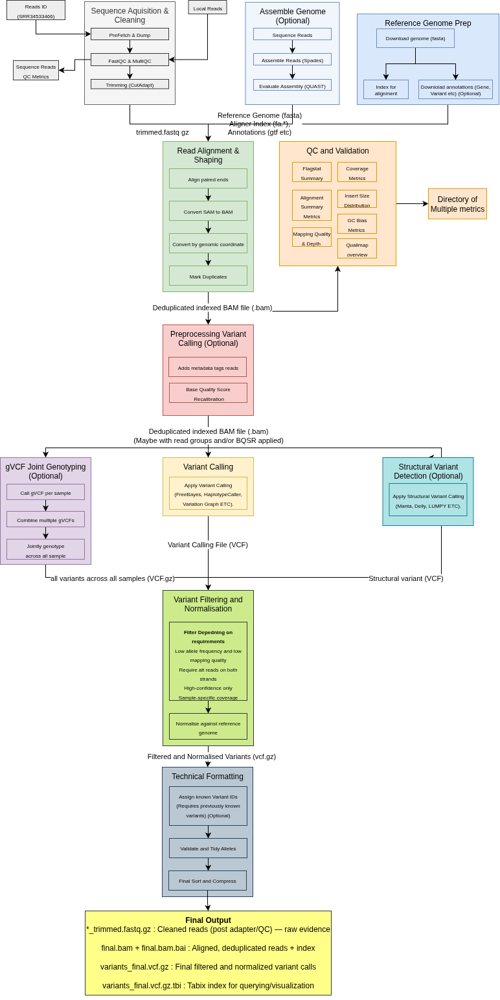

# Omics Processing Pipelines

This repository documents and implements structured pipelines for processing **omics data**, beginning with **genomics** (short-read DNA sequencing). The goal is to provide a clear, modular, and reproducible framework for variant detection and downstream analysis.

## Current Scope

The initial implementation focuses on **short-read whole-genome sequencing (WGS)** in **small eukaryotes** (e.g. *Saccharomyces cerevisiae*), using open-source tools like:
- `fastp`, `Cutadapt`, `BWA`, `samtools`, `FreeBayes`, `bcftools`, and `MultiQC`

## Genomics Processing Overview
The pipeline transforms raw sequencing data (`fastq.gz`) into high-confidence, normalized variant calls (`.vcf.gz`) through a series of standardized steps:

### 1. **Sequence Acquisition & Cleaning**
- Download public datasets or accept local reads
- Perform adapter trimming and quality control
- Aggregate QC results with `MultiQC`

### 2. **(Optional) De Novo Assembly**
- Assemble reads with `SPAdes` and evaluate with `QUAST` (if no reference genome is available)

### 3. **Reference Genome Preparation**
- Download and index the reference genome and annotations for alignment and interpretation

### 4. **Read Alignment & Shaping**
- Align reads to reference genome using `BWA`
- Convert and sort alignments (`SAM → BAM`)
- Mark duplicates and index the final BAM

### 5. **QC and Validation**
- Assess alignment quality, depth, and insert size
- Report mapping metrics, GC bias, and coverage profiles

### 6. **(Optional) Preprocessing for Variant Calling**
- Add read groups and apply base quality score recalibration (BQSR) when needed (e.g. for human or multi-sample GATK workflows)

### 7. **Variant Calling**
- Detect SNPs and indels using `FreeBayes` or other tools
- For GATK-based workflows: output gVCFs and perform joint genotyping

### 8. **Variant Filtering and Normalization**
- Apply filters based on depth, quality, strand bias, and allele frequency
- Normalize variants against the reference genome using `bcftools norm`

### 9. **Technical Formatting**
- Assign known variant IDs (optional)
- Validate VCF formatting and create `.tbi` index for querying

## Final Output

| File Type                  | Description                                  |
|---------------------------|----------------------------------------------|
| `*_trimmed.fastq.gz`      | Cleaned reads after adapter/quality trimming |
| `*.bam` / `*.bai`         | Aligned, sorted, deduplicated reads          |
| `variants_final.vcf.gz`   | Final filtered and normalized variant calls  |
| `variants_final.vcf.gz.tbi` | Index for fast access and visualization   |

